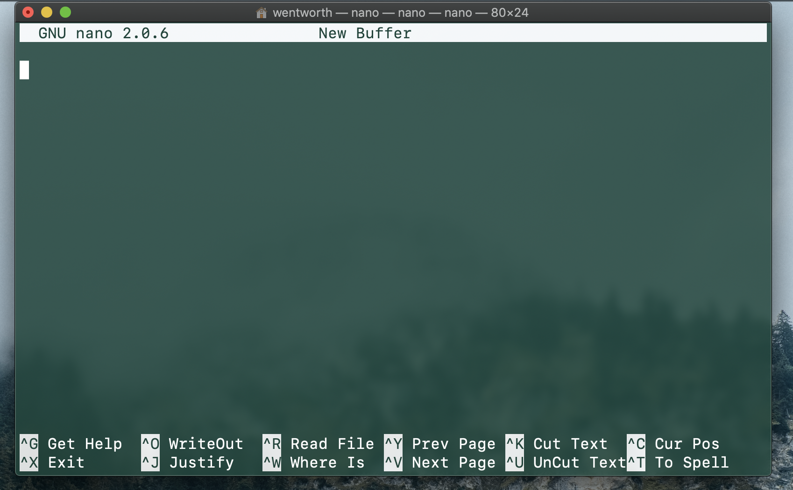

# Command Line & GitHub Tips

*Note: I am in the process of drafting this tips & tricks sheet, and it is not nearly yet complete!*

## Github

### GitHub Dark

This is just for Chrome as far as I can tell, but save your eyes the stress and strain and install [this Extension](https://chrome.google.com/webstore/detail/github-dark-theme/odkdlljoangmamjilkamahebpkgpeacp/related?hl=en-US). It's probably the most important tip on this page!

### Set up your code editor of choice

Apparently when you are contributing to a GitHub repository and encounter a *merge conflict*, you get placed in the default Command Line Interface (CLI) text editor for git from the terminal, VIM. According to GitHub tipsters, this is a horrifying platform that should be avoided at all costs. 

But we are fearless digital paladins on a crusade to refute and overthrow the idea that there are tools too scary or not meant for us to grapple with. VIM is a widely-used TE, and something you should definitely try out in case you ever find yourself in it. It also has unique commands and parameters that are fun to learn and play around with. For more information about VIM, skip to the section about Command Line Interface text editors.

I'd much rather set up my git to automatically open my TE of choice, VS Code.

Type this command into your terminal to do the same:

`% git config --global core.editor "code --wait"`


### Dotfiles
:construction: **Under Construction** :construction:

This tip is something I consider a kind of GitHub and command line two-fer.

According to GitHub developer, Alyson La, "Dotfiles allow you to customize your terminal prompt so you can see what git branch you are on & if you have uncommited changes."<sup>[1](#myfootnote1)</sup>
 So, it stands to reason that this should effectively help you avoid the `git checkout branch` command when you want to know which branch you're currently working out of. 

### Adding footnotes to GitHub-flavored Markdown

```
<sup>[1](#myfootnote1)</sup>

<a name="myfootnote1">1</a>: Footnote content goes here
```
## Command Line

### READ THE MANUAL

A very underrated and underused feature of the terminal for new users that is, ironically, the most helpful to those very users, is the `man` + [terminal command]. This command will bring up the General Commands Manual right in the working terminal window and show you definitions, explanations, and additional command options for whichever terminal command you pair with `man`. Exploring this command will not only help you debug any issues you are having with a command, but also help you gain a more comprehensive understanding of any of the more "basic" commands you're used to using every day.

### Aliases

A time-saving and highly customizable command line feature is the `alias` command. This command allows you to assign a long and/or often-used command to just a couple of easy-to-remember-and-type letters, like an acronym, from the shell profile. 

While you can prescribe an alias to any command or set of commands directly from the terminal, if you want that alias to be more permanent and work whenever you open terminal in the future, you'll want to set this up in either your `.bash_profile`, `.bashrc`, or `.zshrc`.

To start this setup, enter this into the terminal if you are operating macOS Catalina:

`% nano ~/.zshrc`

The `nano` command allows you to write directly in the command line, and `.zshrc` is the z shell equivalent to `.bashrc`.

In this window, you can create any aliases you'd like. I chose to make two: one that manipulates the `ls` command to show me which files in a directory are also directories and which are executable at a glance, as well as colorizes this output. I also chose to further simplify my git push workflow by assigning an alias that turns the long git command into a much more manageable acronym.

If you're interested in these prescriptions, they're listed below:

`alias lsfg="ls -F -G"`

`alias gpom="git push origin master"`


*<div align="center">A snapshot of the Alias section of my `.zshrc`</div>*

### Command Line Interface (CLI) text editors

#### nano

`nano` is the most commonly used CLI text editor. It has a very intuitive interface, allowing you to navigate the text with the up-and-down arrows on your keyboard, use the "return" and "delete" buttons, and provides you with a menu of available commands at the bottom of the window.



#### vim

`vim` is an older, yet powerful, CLI text editor, and, while not quite as popular as `nano`, it is still widely used, and you should be familiar with its unique commands in case you ever find yourself in the position to use it.

Here is a reference list of the most-used `vim` commands<sup>[2](#myfootnote2)</sup>:

- save: :w
- save and exit: :wq
- exit: :q
- force: ! (example :w! :q!)
- vertical split: open a document and then type :vsplit /path-to-document/document. This will open the specified document and split the screen so you can see both documents.
- copy: y
- copy a line: yy
- paste: p
- cut: d
- cut a line: dd

### Oh My Zsh!

"Oh My Zsh!" is an open source package installed at the command line that optimizes your z shell interface. There are three key aspects of this package that make it a particularly useful CLI modifier:

1. Built-in aliases
1. Themes
1. Plug-ins

As discussed in the [alias](#Aliases) section of this page, this command line function is quite useful, as it saves you time and keystrokes by assigning command strings to your chosen acronym in your shell resource. Oh My Zsh! comes with its own suite of aliases, which you can review by entering `alias` into the command prompt.

NOTICE: When you install Oh My Zsh! it will automatically wipe your current alias library, so you'll want to perform a backup if you don't want to lose any of what you may have configured in your shell:

`cp ~/.zshrc ~/backup.zshrc`


<hr>
<a name="myfootnote1">1</a>: "5 GitHub tips for new coders" by Alyson La, https://medium.com/free-code-camp/5-github-tips-for-new-coders.

<a name="my footnote2">2</a>: "Vim Editor Basics" by HowtoForge, https://www.howtoforge.com/vim-basics#vim-command-reference